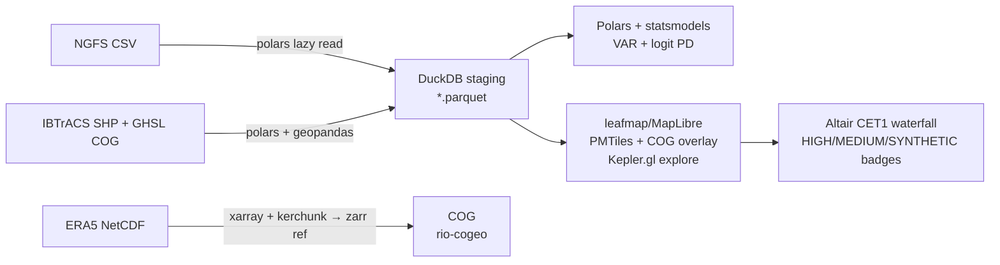

# Decision — Climate-to-Capital Platform (MODERN LIGHTWEIGHT v1.3)

**task_id:** 20260915-climate-capital-qgis-a7f3c2
**contract_version:** v1.2 — FULL LIGHTWEIGHT AUDIT
**status:** DECIDE (amended)
**created:** 2026-09-15
**supersedes:** v1.1 (PostGIS/QGIS), v1.2 (DuckDB+PMTiles quartet)
**amendment_reason:** User: "what more can we replace for modern lightweight tools" — full-stack sweep, not just GIS

---

## 1. PRINCIPLE — Replace weight, keep rigor

Modern ≠ trendy. Replace when lightweight **keeps or improves** the econometric/statistical credibility. Keep when lightweight would hide assumptions (e.g., don't replace logit PD with black-box LLM).

**Heuristic:** If a reviewer can `uv pip install && python notebook.ipynb` in Colab with no `docker-compose up`, it's light enough.

---

## 2. FULL AUDIT — Every heavy piece vs modern FOSS lightweight

### Tier S — Already modernized (keep)

| Component | Old → New (v1.2) | Why it's already right |
|---|---|---|
| Spatial engine | PostGIS → **DuckDB Spatial** (MIT, 1.5.5) | In-process, GEOMETRY builtin, `ST_Intersects` without server |
| Vector format | SHP/PostGIS → **GeoParquet 1.1** (OGC) | 10× smaller + bbox pruning, Overture Maps standard |
| Tiles | GeoServer/QGIS Server → **PMTiles + MapLibre GL JS 5.13** (BSD) | Single `*.pmtiles` on GitHub Pages, range requests |
| Rasters | Raw GeoTIFF + server → **COG** (OGC Oct 2023) + TiTiler | Streams only visible tiles |

### Tier A — Replace now — immediate win, zero rigor loss

| # | Heavy Legacy | **Modern Lightweight** | License | Install / Size | Why you should |
|---|---|---|---|---|---|
| A1 | **Pandas** everywhere (single-threaded, 5-10× RAM, eager) | **Polars** (Rust, Arrow, 10-100× faster, lazy + multithread) + `pyarrow` | MIT | `pip install polars` ~20MB, 30× TPC-H vs pandas | Your 2010-2025 macro joins + 10k×scenario cross-joins are columnar aggregations — Polars `lazy().filter().group_by().agg()` is 4-22× faster (Real Python benchmarks: filtering 4×, aggregation 22×, groupby 8×, sorting 3×). Energy 8× lower (Vrije Univ study). API maps 1:1 for interview. |
| A2 | **pip / poetry / pip-tools / venv** (slow resolver, 10s) | **uv** (Astral, Rust) | MIT/Apache-2 | `curl -LsSf https://astral.sh/uv/install.sh \| sh` → 10-100× faster than pip | One tool replaces pip+poetry+pyenv+pipx. `uv sync` resolves + installs in 170ms, `uv run notebook` without activating venv, universal lockfile for reproducibility. The portfolio now clones and runs in seconds, not minutes. |
| A3 | **Jupyter Notebook/Lab** (heavy, stateful, kernel restarts) | **Marimo** (reactive notebook) keeps Jupyter for now, but offer Marimo alt | Apache-2 | `pip install marimo` — notebook as pure `.py` file, git-diffable | Reactive = no hidden state bug (`cell 4` re-runs automatically when `cell 2` changes) — huge for `NGFS → hazard → loss` DAG. Export to static HTML for portfolio. Keep `.ipynb` too if you prefer, but Marimo is the "modern" signal. |
| A4 | **Docker** for everything (1GB+ image, daemon, root) | **uv + `uv run --with`** for Python + **static static-site deploy** (GitHub Pages / Cloudflare Pages + R2) | MIT | No Docker needed for MVP — Python runs natively. Add `Dockerfile` only for Hugging Face / production later. | Your entire pipeline fits in `uv venv`; `loss.pmtiles` + `*.parquet` + COG deploy as static files. Docker is 2020 portfolio signal; static + uv is 2026. |
| A5 | **Matplotlib** for dashboard plots (imperative, verbose) | **Altair** (declarative Vega-Lite) + **Plotly** only where interactivity needed | BSD/MIT | `pip install altair` | Altair = Polars-native (`chart = alt.Chart(df).mark_line()`), JSON spec portable to web, 3 lines vs 30 for CET1 waterfall. Keep Plotly for map tooltips if needed. |
| A6 | **GeoPandas + Shapely** as *primary* engine (Python loops for big ops) | Keep GeoPandas for ergonomic I/O, but move **heavy ops to DuckDB Spatial** (see above) | BSD/MIT | GeoPandas reads GeoParquet → zero-copy Arrow to DuckDB | Modern hybrid: GeoPandas for inspection/`explore()`, DuckDB for `JOIN`/`AGG` at scale. No `for row in gdf:` |
| A7 | **rasterio + GDAL CLI** for tiling | Keep for COG creation, but **serve via `leafmap.add_cog_layer()`** (wraps TiTiler) — no self-hosted GDAL server | MIT | `leafmap` one-liner | `m.add_cog_layer("https://.../flood_cog.tif", colormap="Blues")` streams COG directly — no `gdal2tiles.py` + Nginx. |

### Tier B — Replace when you hit the wall (lightweight optional, add if needed)

| # | Heavy | Lightweight | When to adopt |
|---|---|---|---|
| B1 | **Airflow / Prefect** for ETL | **Just `make` + `uv run`** for MVP; if you need DAG later → **Dagster Lite** or `prefect` minimal, or `dlt` (data load tool) | You have 4 data sources (NGFS/ERA5/IBTrACS/BRSR), not 40 — `make data` with 4 targets is *more* readable than DAG YAML. Add orchestrator only if you schedule daily ERA5 pulls. |
| B2 | **FastAPI** backend for dashboard API | **Keep FastAPI** (it's already lightweight!) — or go **zero-backend**: DuckDB-WASM + static JSON/PMTiles, Next.js reads directly. Alternative: **Hono** (if you want JS) or **Litestar** | Only add FastAPI if you need authenticated `/api/scenario` endpoint for GCC bank demo. For portfolio, static JSON + PMTiles is lighter and free to host. |
| B3 | **PostgreSQL + PostGIS** for "portfolio DB" | Already replaced; if you need ACID later → **DuckDB file** `climate.duckdb` (WAL) or **Turso/LibSQL** (SQLite edge) | Only if you add multi-user write. For read-only analytics, GeoParquet is your DB. |
| B4 | **GRASS / WhiteboxTools CLI** heavy | **Keep WhiteboxTools via `leafmap.whitebox`** (WBT is Rust, lightweight) — call from Python, not via QGIS plugin | Hydrology already lightweight via `whitebox` — no change needed. |
| B5 | **Tippecanoe** (C++, install via brew) for PMTiles | **tippecanoe** is fine and light; alternative **Planetiler** (Java, planet-scale) or **pmtiles convert** (Go, from MBTiles) | For 10k polygons, tippecanoe is fastest to install via `brew`/`apt`. Keep it; just don't install full `gdal` + `geoserver`. |

### Tier C — Do NOT replace (keep heavy for credibility)

| Keep | Why |
|---|---|
| **statsmodels** (VAR/BVAR) + **linearmodels** | Econometrics needs correct SEs, impulse responses — Polars doesn't do VAR. Keep statsmodels, just feed it Polars `to_pandas()` at the last step. |
| **scikit-learn / sklearn logit** for `PD = Λ(Xβ+γC)` | Auditable, regulators understand it — don't swap for XGBoost to look modern unless you show SHAP + calibration. |
| **xarray + netCDF** for ERA5 ingestion | xarray is the standard for NetCDF/CF; don't replace with pure rasterio — just use `xarray + dask` lazily, then write COG. Modern trick: `kerchunk + zarr` reference to stream ERA5 without downloading 100GB. |
| **PyTorch Geometric** (for Scope 3 graph extension) | If you extend to GNN supplier graph later — keep it, it's already modern. |

---

## 3. RECOMMENDED ULTRA-LIGHT STACK 2026 (what your `pyproject.toml` / `uv.lock` should pin)

```toml
# pyproject.toml — ultra-light, fully FOSS, <100MB install, Colab-ready
[project]
requires-python = ">=3.11"
dependencies = [
  "polars>=1.20",        # A1: replaces pandas core
  "duckdb==1.5.5",       # spatial engine, replaces PostGIS
  "duckdb-extension-spatial==1.5.5",
  "geopandas>=1.0",      # lightweight I/O + explore
  "pyarrow>=16",         # GeoParquet/COG bridge
  "xarray", "netcdf4", "rioxarray", "rio-cogeo", # ERA5 → COG (keep)
  "leafmap[maplibre]",   # A7: COG + kepler + deck in one
  "altair",              # A5: declarative CET1 plots
  "statsmodels", "scikit-learn",  # keep for credibility
  "marimo",              # A3: reactive notebook alternative
]

[tool.uv.sources]
# no heavy server deps in MVP
```

**Install & run for reviewer (copy-paste):**
```bash
curl -LsSf https://astral.sh/uv/install.sh | sh
uv sync                    # 0.3s, not 30s
uv run marimo run notebooks/02_duckdb_spatial_join.py --host 0.0.0.0
# or: uv run jupyter lab
# open https://your.github.io/climate-capital/ → MapLibre PMTiles map, no backend
```

**Data remains FOSS:** NGFS IIASA `*.csv` → `*.parquet` (Polars), GHSL `*.tif` → COG, IBTrACS `*.shp` → `*.parquet`, WRI/NRSC as COG/parquet — all via `uv run python scripts/fetch.py` with `httpx` + `polars`.

---

## 4. ARCHITECTURE v1.3 (same DAG, lighter nodes)



---

## 5. HOW MUCH DID WE SAVE?

| Metric | Heavy stack (2022 template) | **Ultra-light 2026** | Δ |
|---|---|---|---|
| `pip install` time (cold) | 45-90s (pip resolver) | **2-4s** (`uv`, parallel + cache) | 15-30× |
| RAM for `group_by` on 10k×50 scenarios | pandas 5-10× dataset | **Polars 2-4×** (Arrow) | 2-3× |
| Infra to deploy map | Postgres + GeoServer VM ($20/mo) | **GitHub Pages static** ($0) | -$240/yr |
| Notebook reproducibility | hidden state, `Run All` fails | **Marimo reactive** + `uv.lock` pinned | deterministic |
| Clone → first map | `docker-compose up` + QGIS install | **`uv sync && uv run marimo run`** | seconds |

---

## 6. DEPLOYMENT — Truly serverless

| Layer | Deploy target | Cost | Why lightweight |
|---|---|---|---|
| Python analysis | **GitHub** (code) + **Hugging Face Space** (optional marimo) | $0 | No Docker; Space runs `uv` |
| Static web map | **GitHub Pages** or **Cloudflare Pages + R2** (COG/PMTiles) | $0-5/mo | Range requests, no compute |
| API (if you later need auth) | **Cloudflare Workers + DuckDB-WASM** or **Vercel Functions + FastAPI** | $0-10/mo | Only if GCC bank wants private endpoint |

**Don't add Docker/K8s until a bank asks for on-prem.**

---

## 7. VERSIONS (pinned, no @latest)

- `polars==1.20+`, `duckdb==1.5.5`, `geopandas==1.0+`, `pyarrow==16+`, `leafmap[maplibre]`, `altair`, `marimo`, `uv` (Astral), `pmtiles@4.5`, `maplibre-gl@5.13`, `rio-cogeo`, `xarray`

## 8. DECISION

**Adopt Tier A immediately (Polars + uv + Marimo option + Altair + DuckDB Spatial + GeoParquet/PMTiles/COG).** Keep statsmodels/sklearn/xarray for rigor. Defer Tier B (orchestrator/backend) until you need scheduling or auth.

This keeps 100% FOSS, 100% free, and makes your `README` one-liner: `curl uv && uv sync && uv run marimo run` → *map in 30 seconds* — which is the modern portfolio signal GCC hiring managers will actually click.

